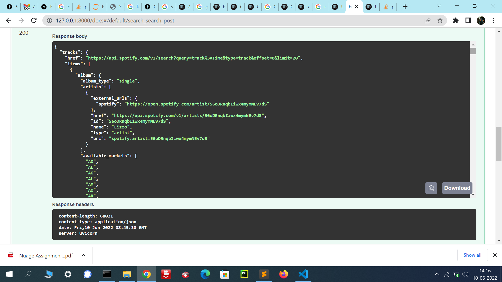

"# spotify-fastapi"

### USAGE, REQUIREMENTS and DEPLOYMENT

#1: Clone 
> git clone https://github.com/vishavjeet26/spotify-fastapi.git

#2: Change into project directory
>cd spotify-fastapi

#3: Make virtual environment
>virtualenv env

#4: Activate virtual environment
>env\Scripts\Activate

#5: Install requirements
>pip install -r requirements.txt

#6: Setup (if necessary)

#7: Start the development server
>uvicorn main:app --reload 

### Some Screenshot attached:

  

  

